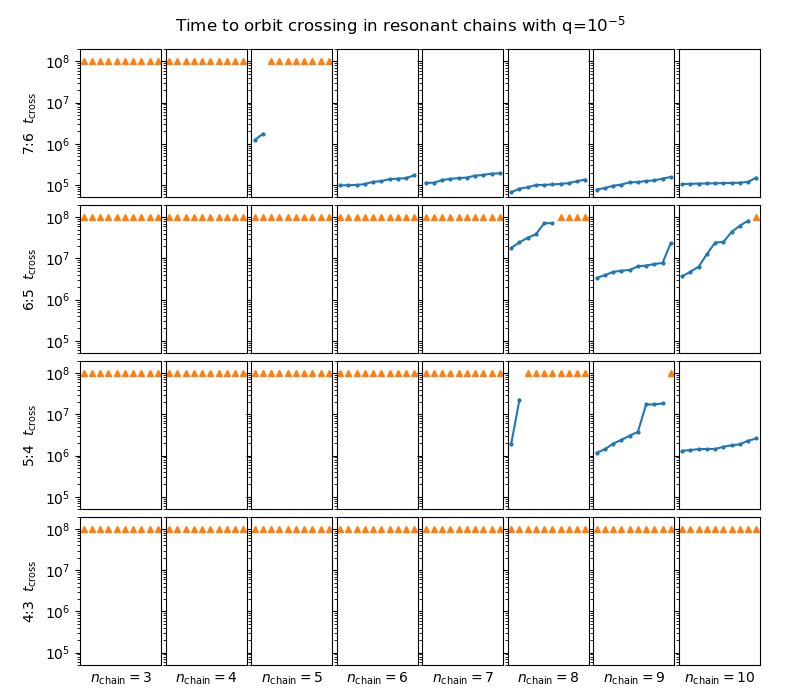

# chains

This is a prototype built to try out some ideas about managing and analyzing scans of n-body simulations. Currently on the second version, Singularity containers are used to provide a repeatable and portable environment for building and executing code. The idea is that this is particularly handy when dealing with myriad dependencies and allows better testing before deployment. Simulation runs are identified with a unique key generated by a hash function from their parameters. Once these are organized into a library object, metadata is primary accessed by importing a source code library. Any simulation output files written are named based on the unique model hash key, making unique naming simple in a flat namespace. To retrive the output, the model object can be looked up in code by parameter values.

## Components

* **Singularity Container**
The entire system is run from a Singularity container (like Docker, but more HPC cluster-friendly) built on the public Sigularity-Hub system. Everything that goes into this container is in this Git repo, or other open ones.
  * Singularity https://sylabs.io
  * Singularity-Hub collection for this repo: https://singularity-hub.org/collections/3350

* **SGE job array script**
Allocates nodes and set the containers running on the cluster.

* **Driver Class**
A class which, informed by the Campaign object, directs execution of the simulation in a Model object, triggering I/O, checkpointing, restarts, and wall clock limits from the queue system.

* **Campaign Class**
A class which implements a library of Model objects. Primarily provides indexes to look up Model objects by parameter values.

* **Model Class**
A class which hold a full set of parameters and initiates, restarts, integrates, and checkpoints a REBOUND/REBOUNDx simulation. Importantly, each Model object computes a unique MD5 hash from the complete set of parameters, which yield a globally unique identifier. Data is stored with the idientifier as the key, which can be looked up by parameter values the Campaign class.

* **REBOUND and REBOUNDx**
Model objects create and call methods from REBOUND n-body integrator objects. REBOUNDx, with some additional effects implemented (in crbx/) is used to provide additional forces beyond gravity. 
  * REBOUND https://rebound.readthedocs.io
  * REBOUNDx https://reboundx.readthedocs.io

## Does it work?
One problem implemented in this system is the long-term stability of resonant chains of planets, in the style of:

> Matsumoto, Y., Nagasawa, M., & Ida, S. (2012). 
> The orbital stability of planets trapped in the first-order mean-motion resonances. 
> Icarus, 221(2), 624–631. http://doi.org/10.1016/j.icarus.2012.08.032

The first set of results generated confirms the basic pattern in
Matsumoto et al. (2012), that although chains in mean motion resonance (MMR) have 
much longer stability times than non-resonant ones with similar spacing, there exists 
a critical length of chain beyond which the stability timescale rapidly decreases.
For planets of planet mass / star mass ratio q=1e-5 they give critical chain lengths 
of 8 in 6:5 MMR and 4 in 7:6 MMR.

The data from these simulations performed with the old_v1 version on the orbit crossing time is:

where orange triangles indicate lower bounds.
